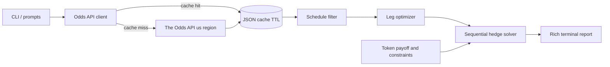

# Bonus Token Arbitrage Finder

## Goal
Given a sport, required number of legs, token sportsbook, and bonus token (profit boost, free bet, or odds boost) with its constraints (min legs, max stake, optional boost cap, optional odds limits), pull FanDuel + DraftKings odds and output the best bet(s) plus a stake schedule for sequential leg-by-leg hedging.

The MVP should focus on guaranteed-profit opportunities where the math can be verified. If no guaranteed-profit plan exists, the CLI should clearly say so and optionally show the best positive expected value alternatives separately.

## Tech choices
- Python 3.11 (already installed). Dependencies: `requests` (HTTP), `rich` (terminal tables/panels), `python-dotenv` (`ODDS_API_KEY`), `pytest` (tests).
- API key read from a `.env` file (never committed); `.env.example` provided.
- Terminal-first app, no web UI in the MVP. Do not automate bet placement; print instructions the user verifies manually in each sportsbook app.

## Key API constraints (confirmed)
- Free tier = 500 credits/month; cost = `markets x regions`. Empty responses are free.
- `bookmakers=fanduel,draftkings` counts as 1 region. So one pull of `h2h,spreads,totals` for a sport = 3 credits and returns both books.
- Player props require a paid plan -> free tier legs are game-level markets only (`h2h`, `spreads`, `totals`).
- Default to `h2h` (2-way moneyline) legs: cleanest hedge (no line-mismatch/middle risk), and games resolve at distinct times so they can be hedged sequentially.
- Use `/v4/sports` for sport discovery (free), then `/v4/sports/{sport}/odds` with `bookmakers=fanduel,draftkings`, `regions=us`, `oddsFormat=decimal`, and `markets=h2h` by default.
- Keep `spreads` and `totals` as opt-in later markets because line mismatches can create middle/push risk that is not a pure guaranteed hedge.

## Architecture / files
- `.env.example`, `requirements.txt`, `README.md`
- `config.py` - load env, constants (region=`us`, books, cache TTL, credit-warn threshold, sport duration defaults)
- `bonusarb/oddsapi/client.py` - HTTP client, reads `x-requests-remaining/used` headers, surfaces quota, handles errors/rate limits
- `bonusarb/oddsapi/cache.py` - on-disk JSON cache with TTL to conserve credits (`--no-fetch` uses cache only)
- `bonusarb/models.py` - dataclasses: `Game`, `Market`, `Outcome`, `Leg`, `Token`, `TokenConstraint`, `HedgePlan`, `BookmakerKey`
- `bonusarb/odds_utils.py` - decimal<->american conversion, implied prob, vig, best-price-across-books lookup
- `bonusarb/tokens.py` - token definitions + payoff functions returning `(S_cost, W)`:
  - Profit boost (cash): `S_cost = S`, win profit `W = S*(O-1) + min(S*(O-1)*b, boost_cap_or_infinity)`
  - Free bet (stake not returned): `S_cost = 0`, `W = S*(O-1)`
  - Odds boost: replace combined odds `O` with boosted `O'`, `S_cost = S`, `W = S*(O'-1)`
- `bonusarb/schedule.py` - sequence feasibility: leg order, estimated sport duration, buffer between previous expected finish and next start
- `bonusarb/arb/sequential.py` - N-leg sequential hedge solver (below); N=1 handles the classic single-leg two-way hedge
- `bonusarb/arb/optimizer.py` - pick the best N legs for the token book to maximize locked profit; optionally rank +EV plans when guaranteed profit is unavailable
- `bonusarb/report.py` - rich terminal output (parlay slip + timed hedge schedule)
- `bonusarb/cli.py` - argparse entrypoint + interactive prompts
- `tests/` - unit tests for odds math, token payoff/caps, single hedge, sequential solver, schedule filtering, and optimizer fixtures

## Sequential hedge math (core engine)
Legs ordered by expected resolution time. The next leg must start after the previous leg should be final, plus a configurable safety buffer. Parlay of N legs is placed on the token book (`fanduel` or `draftkings`) with combined decimal odds `O = product(a_i)`. For each leg `k`, hedge the opposite outcome at the best available decimal odds `b_k` from the configured hedge books. Let `S_cost`/`W` come from the token payoff. Solve for hedge stakes `h_k` and locked profit `P` so profit is equal across every resolution path:
- Parlay dies at leg k: `P = h_k*(b_k - 1) - sum_{i<k} h_i - S_cost`
- All legs win: `P = W - sum_{i=1..N} h_i`

Each `h_k` is linear in `P` via forward recursion (`h_k = (P + C_k + S_cost)/(b_k - 1)`, `C_{k+1}=C_k+h_k`); the win-all equation then pins `P` in closed form. If `P > 0` for the best leg set, profit is guaranteed regardless of outcome.

Stake choice should not always blindly use the max token stake. With no boost cap, profit scales linearly and max stake is optimal. With a boost/profit cap or bankroll limit, evaluate candidate stakes up to `max_stake` and choose the stake that maximizes locked dollars or ROI, based on a CLI option.

## Leg optimizer
Pull all games once; enumerate candidate h2h legs from the selected token book. For each candidate, find the opposite side at the configured hedge book(s), usually the other book by default. Brute-force combinations of size N while pruning invalid plans:
- one side per event only
- enough time between legs to wait for the prior result and place the next hedge
- token constraints satisfied (sport, min legs, max stake, optional event/team filters, optional max odds/min odds)
- projected hedge stakes fit the user's available hedge bankroll

For typical daily boards, brute force should be fine. Add a greedy fallback only if candidate count gets large.

## CLI UX
```
python -m bonusarb --sport basketball_nba --legs 3 \
  --token-book fanduel --token profit_boost --boost 0.30 --max-stake 25
```
- No flags -> interactive prompts (list sports via the free `/sports` endpoint).
- Shows credits remaining before/after each fetch; refuses fetch if it would exceed a safety threshold.
- Important flags: `--token-book`, `--hedge-book`, `--legs`, `--sport`, `--token`, `--boost`, `--max-stake`, `--boost-cap`, `--bankroll`, `--min-gap-minutes`, `--cache-ttl`, `--no-fetch`, `--dry-run`, `--show-ev`.
- Add a `--recheck` mode that refreshes odds right before the user places bets, then recomputes the hedge stakes.

## Terminal output (example shape)
- Panel: token summary + credits used/remaining.
- Table 1 "Place on token book": the N-leg parlay, per-leg odds, combined odds, stake, and token constraints satisfied.
- Table 2 "Hedge schedule" (ordered by game time): for each leg, the opposite bet, which book, odds, stake `h_k`, place-by time.
- Footer: guaranteed profit `P`, maximum cash needed, ROI, and worst-case path check.
- Warnings: odds move risk, manual verification required, free-tier market limitations, and whether the plan depends on estimated game duration.

## Data flow


## Scope notes / limitations (surfaced to user)
- Free tier: no player props; legs are moneyline by default. Spreads/totals optional with a line-mismatch/middle-risk warning.
- Sequential hedging requires the previous leg to finish before the next begins; overlapping or too-close candidates are flagged/excluded.
- 3-way markets (soccer draw) deferred; start with 2-way US sports (NBA, NFL, MLB, NHL).
- Odds move between placement and hedge; report shows sensitivity and a re-check option.
- The program is informational and does not place bets. The user must verify app rules, token eligibility, house rules for voids/pushes, and local betting legality.

## Suggested extra improvements
- Credit budget guardrail + cache so a full session costs ~3 credits.
- `--dry-run` using bundled sample data (0 credits) for testing.
- Save each computed plan to `history/` for later comparison.
- Sensitivity analysis: show how much each hedge price can worsen before guaranteed profit drops to zero.
- Future paid-tier upgrade path: add event-level player props once the API plan supports them.