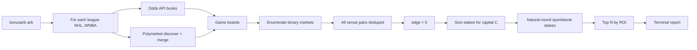

# General 1-Leg Arbitrage Finder

Locked decisions from your answers:

- **All-pairs** venue shopping (every sportsbook vs every other sportsbook, and vs Polymarket)
- **New subcommand** `python -m bonusarb arb`
- **Fixed total capital**, configurable, **default $100**
- **Natural sportsbook stakes** (see below); Polymarket stakes unrestricted
- **Markets:** `h2h`, `spreads`, `totals` (same as today)
- **Leagues:** NHL, NFL, MLB, NBA, WNBA — **no UFC**; **all leagues in one run**
- **Report-only** for v1 (auto-hedger wiring later)
- **Rank by ROI**; keep any opportunity with **edge > 0**

## Context

Today’s tool is profit-boost–centric: you pick a **token book**, set boost %, and optionally use `--boost 0 --legs 1`. That only evaluates **one primary book** against best hedges, so it misses arbs where the best long side is elsewhere (or on Polymarket).

A true 1-leg general arb is: for a binary market, find venues A,B and opposite outcomes such that

\frac{1}{o_A} + \frac{1}{o_B} < 1

then size stakes under fixed capital C so both win paths are profitable (after optional sportsbook stake rounding).

## Approach

Add a **separate scan path** (not a boost=0 hack) that:

1. Fetches odds + Polymarket discover/merge for **every non-UFC league** in one run
2. Enumerates **all venue pairs** on each market outcome pair
3. Sizes classic 2-way stakes with natural rounding on sportsbooks
4. Ranks by ROI and prints a dedicated report

## Core math (new module)

Add `[bonusarb/arb/two_way.py](bonusarb/arb/two_way.py)`:

- `arb_edge(odds_a, odds_b) -> float` — `1 - 1/o_a - 1/o_b` (keep iff `> 0`)
- `size_two_way_arb_continuous(odds_a, odds_b, total_capital)` — equalize returns under s_a + s_b = C
- `size_two_way_arb(...)` — wraps continuous sizing + **natural stake rounding** (below)
- After rounding, locked profit = **min** of the two win-path profits (may be slightly unequal); drop if either path ≤ 0
- Use Polymarket **fee-adjusted** decimal odds from merge as-is

Reuse push-prone exclusion and exact opposite-line matching from `[bonusarb/odds_utils.py](bonusarb/odds_utils.py)`.

### Natural sportsbook stakes

Sportsbook stakes must look “normal,” not like `42.12` / `57.88`. A stake is **natural** if it is a positive integer that:

- ends in `0` or `5` (multiple of 5), **or**
- is a repeated-digit amount like `11`, `22`, `33`, `44`, `66`, `77`, `88`, `99` (and the same pattern at higher magnitudes if capital allows, e.g. `111`)

**Book vs book:** both stakes must be natural and sum exactly to capital C when possible (e.g. for C=100: `35/65`, `40/60`, `22/78` only if both natural — `78` is not, so invalid). Search natural pairs (s_a, s_b) with s_a + s_b = C, pick the pair that maximizes worst-case path profit (accept slightly lower profit vs continuous sizing). If no natural pair sums to C with positive profit, fall back to nearest natural pair with sum ≤ C and leftover unallocated (or skip the opp if none stay +EV).

**Book vs Polymarket:** round the **sportsbook** side to the nearest natural near the continuous optimum (still ≤ C); Polymarket stake = C - s_{\text{book}} and may be any fractional amount. Recompute worst-case locked profit; drop if not positive.

## Opportunity enumeration

Add `[bonusarb/arb/general.py](bonusarb/arb/general.py)`:

For each league’s games, for each market in `{h2h, spreads, totals}`:

- Collect every book’s outcomes including `polymarket`
- All distinct venue pairs; opposite outcomes (spreads/totals: exact opposite points; skip push-prone whole numbers)
- Deduplicate by stable key: `game + market + line + frozenset{(book, outcome)}`
- Keep only `edge > 0`
- Polymarket volume already gated by existing merge filter

Model: `TwoWayArb` dataclass (league, game, market, selections, books, odds, points, stakes, locked_profit, roi, edge, optional Polymarket token ids).

## CLI / runner

- New subcommand: `python -m bonusarb arb` (route like `auto` in `[bonusarb/cli.py](bonusarb/cli.py)`)
- New `[bonusarb/arb_cli.py](bonusarb/arb_cli.py)` + `scan_two_way_arbs` in `[bonusarb/runners.py](bonusarb/runners.py)`
- **Default:** scan **all** of `icehockey_nhl`, `americanfootball_nfl`, `baseball_mlb`, `basketball_nba`, `basketball_wnba` (exclude `mma_mixed_martial_arts`)
- Optional `--sport` to restrict to one league for cheaper/faster scans
- Flags: `--capital` (default **100**), `--market`, `--top`, `--dry-run`, `--no-fetch`, `--recheck`, `--cache-ttl`, FX flags
- Interactive: confirm/adjust capital (default 100), optional market filter — **no** league/token/boost/legs prompts by default
- No token-book / boost / legs

Fetch path per league: Odds API → upcoming filter → Polymarket discover → merge → enumerate; aggregate opportunities across leagues, then rank.

## Reporting

Extend `[bonusarb/report.py](bonusarb/report.py)` / `[bonusarb/display.py](bonusarb/display.py)`:

- Sort **by ROI descending** (edge > 0 already filtered)
- Show ROI, locked profit (worst-case after rounding), edge %
- Both sides: book, selection, odds, stake (natural ints for sportsbooks)
- “Place both now” (simultaneous)
- Note Polymarket side is manual for v1

## Out of scope (v1)

- Multi-leg / sequential hedges
- Middles (non-exact opposite lines)
- Auto-hedger integration (wire later when one side is Polymarket)
- UFC / MMA in the arb league set

## Tests

- Continuous sizing + edge math
- Natural stake helpers: `35`/`65` ok; `42` rejected; `22` ok; book-book prefers `35/65` over continuous `42.12/57.88`
- Book vs Polymarket: sportsbook natural, Polymarket fractional
- Enumeration: FD vs DK, FD vs Polymarket, vig-no-arb, spreads exact-line, push-prone skipped
- Multi-league dry-run CLI smoke
- Ranking by ROI

## Files to touch

| File                                                                             | Change                                         |
| -------------------------------------------------------------------------------- | ---------------------------------------------- |
| `[bonusarb/arb/two_way.py](bonusarb/arb/two_way.py)`                             | Edge, continuous sizing, natural rounding      |
| `[bonusarb/arb/general.py](bonusarb/arb/general.py)`                             | All-pairs enumerator                           |
| `[bonusarb/models.py](bonusarb/models.py)`                                       | `TwoWayArb`                                    |
| `[bonusarb/config.py](bonusarb/config.py)`                                       | Arb league list (LEAGUES minus UFC) if helpful |
| `[bonusarb/runners.py](bonusarb/runners.py)`                                     | Multi-league `scan_two_way_arbs`               |
| `[bonusarb/arb_cli.py](bonusarb/arb_cli.py)`                                     | New CLI                                        |
| `[bonusarb/cli.py](bonusarb/cli.py)`                                             | Route `arb`                                    |
| `[bonusarb/report.py](bonusarb/report.py)` / `[display.py](bonusarb/display.py)` | ROI-ranked arb report                          |
| `tests/test_two_way.py`, `tests/test_general_arb.py`                             | Coverage                                       |
| `[README.md](README.md)`                                                         | `arb` usage                                    |

