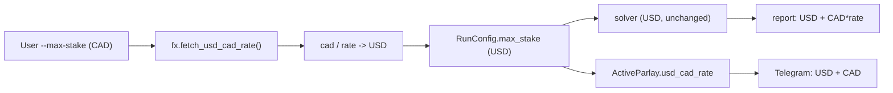

# Live CAD/USD FX conversion + asymmetric resolution thresholds

## Decisions locked in
- FX: live rate fetched at run time (no fixed value). Free no-key source: `open.er-api.com` (hourly real market rates). Manual `--fx-rate` override allowed; fetch failure with `--cad` and no override = hard error (never silently use a wrong rate).
- Scope: CAD conversion applies to **both** the default scan and the auto command.
- Thresholds: **asymmetric** — 0.99 to declare WON (place next hedge), 0.97 to declare LOST (stop). Won direction needs hedge price <= 0.01; lost direction triggers at hedge price >= 0.97.

## FX model
1 USD = `rate` CAD (rate ~1.42). The solver stays 100% in USD (no solver changes). Conversion happens at two boundaries:
- **Input boundary:** user enters `--max-stake` / `--bankroll` in CAD; convert to USD before building `RunConfig`. Polymarket hedges then place in correct USDC.
- **Display boundary:** profit/cost shown in USD (canonical) plus a CAD equivalent when a rate is present. ROI is unitless (unchanged).

Rate is fetched once at run start and reused for the whole session (you said intra-day movement isn't a concern). Stored on `RunConfig` and `ActiveParlay` so resume shows consistent CAD.



## Components to build / change

### 1. New FX utility `bonusarb/fx.py`
- `fetch_usd_cad_rate(source=DEFAULT_FX_SOURCE, timeout=10) -> float` — GET `https://open.er-api.com/v6/latest/USD`, return `rates["CAD"]`. Raise `FxError` on failure.
- `cad_to_usd(cad, rate)`, `usd_to_cad(usd, rate)` helpers.
- `DEFAULT_FX_SOURCE` constant; `AUTO_FX_SOURCE` env override supported in `config.py`.

### 2. Config + CLI flags
- `bonusarb/config.py`: add `AUTO_FX_SOURCE`, `AUTO_WON_THRESHOLD` (0.99), `AUTO_LOST_THRESHOLD` (0.97). Keep `AUTO_DECIDED_THRESHOLD` reading as a backward-compat alias for the lost threshold if the new vars are unset.
- `bonusarb/cli.py` `build_parser()`: add `--cad` (flag) and `--fx-rate` (optional manual override) to the default command.
- `bonusarb/auto/cli.py` `build_auto_parser()`: same `--cad` / `--fx-rate`; replace `--decided-threshold` with `--won-threshold` and `--lost-threshold`.
- `.env.example`: document `AUTO_FX_SOURCE`, `AUTO_WON_THRESHOLD`, `AUTO_LOST_THRESHOLD`.

### 3. RunConfig + stake conversion
- `bonusarb/runners.py`: add `display_cad_rate: float | None = None` to `RunConfig`.
- In `collect_interactive_config` and `config_from_args`: when `--cad`, resolve the rate (via `--fx-rate` override or `fx.fetch_usd_cad_rate()`), convert `max_stake` and `bankroll` CAD -> USD, print the rate used, and set `display_cad_rate`. Without `--cad`, behavior is unchanged (USD, `display_cad_rate=None`).
- `prompt_float_step` for max stake: label it "(CAD)" when `--cad` is set; conversion happens after input.

### 4. Report rendering (default command)
- `bonusarb/report.py`: `render_report` and `_plan_panel` accept an optional `cad_rate: float | None`. When present, append CAD equivalents to the footer (locked profit, max cash, win profit). ROI stays as-is. USD remains the primary figure so nothing existing breaks.
- `runners.run_auto` passes `config.display_cad_rate` into `render_report`.

### 5. Auto command display
- `bonusarb/auto/select.py` `prompt_pick_plan`: show `locked $X USD / $Y CAD` when a rate is set.
- `bonusarb/auto/state.py` `ActiveParlay`: add `usd_cad_rate: float | None = None`; set it in `from_plan` from the RunConfig's rate so resume and summaries are consistent.
- `bonusarb/auto/notify.py`: `hedge_placed` / `complete` / `alert` accept an optional rate and append CAD where money is shown.
- `bonusarb/auto/monitor.py` `_finalize_all_won` / `_finalize_dead`: compute net in USD (canonical) and include CAD equivalent using `parlay.usd_cad_rate`.

### 6. Asymmetric watcher thresholds
- `bonusarb/auto/watcher.py`: replace `decided_threshold` with `won_threshold: float = 0.99` and `lost_threshold: float = 0.97`. New `_classify`:

```python
def _classify(self, hedge_price: float) -> LegResolution:
    if hedge_price >= self.lost_threshold:        # hedge side won -> leg LOST -> stop
        return LegResolution(LOST, hedge_price)
    if hedge_price <= 1.0 - self.won_threshold:   # hedge side lost -> leg WON -> place next
        return LegResolution(WON, hedge_price)
    return LegResolution(PENDING, hedge_price)
```

- `bonusarb/auto/config.py` `AutoConfig`: replace `decided_threshold` with `won_threshold` and `lost_threshold` (defaults 0.99 / 0.97), loaded from env.
- `bonusarb/auto/cli.py`: pass both to `ResolutionWatcher`; `--won-threshold` / `--lost-threshold` flags override env.

### 7. Tests (append to `tests/test_auto.py` + new `tests/test_fx.py`)
- `test_fx.py`: `fetch_usd_cad_rate` parses a mocked `{"rates":{"CAD":1.42}}`; raises `FxError` on network/parse failure; `cad_to_usd`/`usd_to_cad` round-trip.
- `RunConfig` CAD conversion: `--cad` with a mocked rate converts `max_stake` 25 CAD -> ~17.6 USD and sets `display_cad_rate`; without `--cad` no conversion.
- Watcher asymmetric: hedge 0.97 -> LOST, 0.98 -> LOST, 0.011 -> PENDING, 0.01 -> WON, 0.005 -> WON (independent won/lost thresholds).
- Report CAD: with `cad_rate=1.42`, footer includes CAD equivalents; without, unchanged (regression-safe).
- State: `ActiveParlay.from_plan` stores `usd_cad_rate` and round-trips through `load_parlay`.

## Non-goals / notes
- No solver math changes — it stays in USD. FX only touches input + display.
- No per-hedge FX refetch (you said intra-day movement is fine); one rate per session.
- `--check` wallet balance stays in USDC (it's on-chain, already USD-denominated).
- Existing `tests/test_auto.py` watcher test (`test_watcher_classifies_won_lost_pending`) will need its single-threshold assertions updated to the asymmetric defaults.

## Files touched
- New: `bonusarb/fx.py`, `tests/test_fx.py`
- Edit: `bonusarb/config.py`, `bonusarb/cli.py`, `bonusarb/runners.py`, `bonusarb/report.py`, `bonusarb/auto/cli.py`, `bonusarb/auto/config.py`, `bonusarb/auto/watcher.py`, `bonusarb/auto/select.py`, `bonusarb/auto/state.py`, `bonusarb/auto/notify.py`, `bonusarb/auto/monitor.py`, `.env.example`, `tests/test_auto.py`